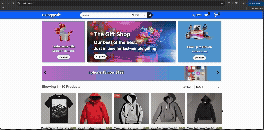

# E-Commerce Application

This is an E-Commerce Website that allows users to search products, add products to the shopping cart or wish list, and checkout products.
From shopping to basket, users can sort, search, and filter products. They can easily add items to their basket and update quantities as needed.

## Application Demo



## Functionalities

Users can view all items when entering the website
Items can be sorted based on the selected category
Users can search items through search box
Support paging with Infinite scrolling
Users can see item details by selecting a specific item
Users can add items to their shopping carts
Users can register/login using using firebase authentication
Users can update personal profiles with shipping addresses and other info
Users can checkout with Paypal payment gateway
 
## Implementation

Application is implemented in two parts:
RESTfull web services: API's build using spring boot are used for handling all the back end operations which includes session management using encrypted JWT Tokens
Front End: User interfaces designed and developed using Angular utilising web services for handling appropriate user actions

## Angular Features

* Stand alone components
* signal
* Lazy loaded components for each feature.
* zoneless change detection.
* Angular Routing
* Reactive Forms
* Auth guards
* HTTP Interceptors
* Form validation

## Application Features

* Data loading using ngx skeleton loader.
* Infinite scrolling to load more products.
* Product details page.
* Product sorting by price and name.
* Product filtering by category.
* Zoom in functionality in product details page.
* Add products to cart or wishlist. 

## Built with

* [Angular](https://angular.io/).
* [Typescript](https://www.typescriptlang.org/)
* [Bootstrap](https://getbootstrap.com/).
* [Fontawesome](https://fontawesome.com/).
* [ngx-skeleton-loader](https://www.npmjs.com/package/ngx-skeleton-loader).
* [ngx-infinite-scroll](https://www.npmjs.com/package/ngx-infinite-scroll).
* [rxjs](https://rxjs.dev/).


## Running the project

In the project directory, you can run:

#### `npm install`

To install all dependencies in package.json.

#### `npm serve`

It runs the app in the development mode.<br />
Open [http://localhost:4200](http://localhost:4200) to view it in the browser.

## API

Platzi Fake Store API
The Platzi Fake Store API is a comprehensive development resource designed for projects requiring e-commerce data in JSON format. 
[Read more...](https://fakeapi.platzi.com/en/about/introduction/)

API root URL: https://api.escuelajs.co/api/

Get User Profile: https://api.escuelajs.co/api/v1/auth/profile

Update User Profile: https://api.escuelajs.co/api/v1/users/<<userId>>

Get Product lists with Pagination: v1/products?offset=<<offset>>&limit=<<limit>>

Get single product detail : v1/products/<<productId>>

Get product list for category:  v1/categories/<<productId>>/products?offset=0&limit=10

## Authentication with JWT

This API uses JSON Web Tokens (JWT) for secure authentication.

## Error Handling

Common authentication errors include:
401 Unauthorized: Invalid credentials or expired tokens
403 Forbidden: Valid authentication but insufficient permissions
400 Bad Request: Malformed request body or headers

## Development server

This project was generated using [Angular CLI](https://github.com/angular/angular-cli) version 21.0.0.

To start a local development server, run:

```bash
ng serve
```
Once the server is running, open your browser and navigate to `http://localhost:4200/`. The application will automatically reload whenever you modify any of the source files.

## License

MIT License

Permission is hereby granted, free of charge, to any person obtaining a copy
of this software and associated documentation files (the "Software"), to deal
in the Software without restriction, including without limitation the rights
to use, copy, modify, merge, publish, distribute, sublicense, and/or sell
copies of the Software, and to permit persons to whom the Software is
furnished to do so, subject to the following conditions:

The above copyright notice and this permission notice shall be included in all
copies or substantial portions of the Software.

THE SOFTWARE IS PROVIDED "AS IS", WITHOUT WARRANTY OF ANY KIND, EXPRESS OR
IMPLIED, INCLUDING BUT NOT LIMITED TO THE WARRANTIES OF MERCHANTABILITY,
FITNESS FOR A PARTICULAR PURPOSE AND NONINFRINGEMENT. IN NO EVENT SHALL THE
AUTHORS OR COPYRIGHT HOLDERS BE LIABLE FOR ANY CLAIM, DAMAGES OR OTHER
LIABILITY, WHETHER IN AN ACTION OF CONTRACT, TORT OR OTHERWISE, ARISING FROM,
OUT OF OR IN CONNECTION WITH THE SOFTWARE OR THE USE OR OTHER DEALINGS IN THE
SOFTWARE.